<p align="center">
  
</p>

<h1 align="center">Agent Kits</h1>

<p align="center">
  <b>Bộ công cụ AI Agent phổ quát</b><br/>
  <sub>Skills, Agents, và Workflows cho mọi trợ lý AI lập trình</sub>
</p>

<p align="center">
  <a href="https://www.npmjs.com/package/@neyugn/agent-kits"></a>
  <a href="https://www.npmjs.com/package/@neyugn/agent-kits"></a>
  <a href="https://github.com/nvdnvd00/agent-kits/blob/main/LICENSE"></a>
</p>

<p align="center">
  <a href="./README.md">English</a> •
  <b>Tiếng Việt</b> •
  <a href="./README.zh.md">中文</a>
</p>

<br/>

## ✨ Agent Kits là gì?

**Agent Kits** là bộ công cụ phổ quát giúp nâng cấp trợ lý AI lập trình của bạn với:

- 🤖 **Agent Chuyên gia** — Các Agent được định nghĩa sẵn với chuyên môn sâu trong từng lĩnh vực
- 🧩 **Skills Tái sử dụng** — Best practices và các framework hỗ trợ ra quyết định
- 📜 **Workflows** — Các slash command cho công việc thường gặp
- 🔍 **Lọc Thông minh** — Tự động phát hiện techstack và tối ưu skills được load

Hoạt động với **mọi công cụ AI** — Claude, Gemini, Codex, Cursor, và nhiều hơn nữa.

<br/>

## 🚀 Bắt đầu nhanh

```bash
npx @neyugn/agent-kits@latest
```

Đó là tất cả! Installer tương tác sẽ hướng dẫn bạn:

1. Chọn công cụ AI của bạn (Claude, Gemini, Cursor, etc.)
2. Chọn phạm vi cài đặt (Global hoặc Workspace)
3. Chọn kits cần cài đặt
4. Xác nhận đường dẫn cài đặt

### 🤖 Agent Activation Protocol

Khi bạn kích hoạt một agent, hệ thống tuân theo protocol 5 bước:

```
1. Phân loại intent → chọn agent
2. Thông báo: 🤖 **@{agent} activated!**
3. Đọc: .claude/agents/{agent}.md
4. Load skills từ frontmatter → đọc .claude/skills/{skill}/SKILL.md
5. Thực thi
```

**Ưu tiên:** DEBUG > CREATE > PLAN > QUESTION

<br/>

## 🖥️ Các lệnh CLI

```bash
npx @neyugn/agent-kits                  # Khởi động installer tương tác
npx @neyugn/agent-kits --check-updates  # Kiểm tra phiên bản mới
npx @neyugn/agent-kits --version        # Hiện phiên bản hiện tại
npx @neyugn/agent-kits --help           # Hiện trợ giúp
```

**Ví dụ output khi có phiên bản mới:**

```
╭─────────────────────────╮
│  agent-kits v0.5.0     │
│  Latest:   v0.6.0      │
╰─────────────────────────╯

  ⚠ Update available! Run below to update:
  npx @neyugn/agent-kits@latest
```

<br/>

## 📌 Lưu ý quan trọng

### Slash commands không hiện trong dropdown của IDE

Nếu `.agent/` (hoặc `.cursor/`, `.opencode/`, v.v.) bị thêm vào `.gitignore`, một số IDE sẽ bỏ qua việc index các file bên trong — bao gồm cả thư mục `workflows/` là nơi cung cấp các slash commands như `/plan`, `/debug`, `/create`.

**Cách khắc phục:** Thêm rule phủ định vào `.gitignore` để buộc index thư mục workflows:

```gitignore
# Bỏ qua thư mục kit (tùy chọn)
.agent/

# Nhưng luôn index workflows để slash commands hoạt động trong IDE
!.agent/workflows/
!.agent/workflows/**
```

> **Khuyến nghị:** Xóa thư mục kit khỏi `.gitignore` và commit nó cùng với code của bạn.

<br/>

## ✨ Tính năng

### 🌍 Global vs Workspace

| Chế độ      | Vị trí        | Use Case                      |
| ----------- | ------------- | ----------------------------- |
| 📁 Workspace | `./{{tool}}/` | Cấu hình riêng cho từng dự án |
| 🌍 Global   | `~/{{tool}}/` | Dùng chung cho tất cả dự án   |

**Đường dẫn Global theo công cụ:**

| Công cụ     | Đường dẫn Global | Đường dẫn Workspace |
| ----------- | ---------------- | ------------------- |
| Claude Code | `~/.claude/`     | `.claude/`          |
| Gemini CLI  | `~/.gemini/`     | `.gemini/`          |
| Codex CLI   | `~/.codex/`      | `.codex/`           |
| Antigravity | `~/.agent/`      | `.agent/`           |
| Cursor      | `~/.cursor/`     | `.cursor/`          |

> **Lưu ý:** Trên Windows, `~` được thay bằng `C:\Users\<username>\`

### 🔄 Phát hiện cài đặt có sẵn

Nếu installer phát hiện cài đặt đã tồn tại, bạn sẽ được hỏi:

- **🔄 Thay thế**: Xóa cũ và cài mới
- **🔀 Merge**: Giữ config, chỉ cập nhật skills
- **⏭️ Bỏ qua**: Giữ nguyên, không cài đặt
- **❌ Hủy**: Thoát installer

### 🔌 Tương thích phổ quát

| Công cụ     | Đường dẫn Workspace | Đường dẫn Global | Trạng thái       |
| ----------- | ------------------- | ---------------- | ---------------- |
| Antigravity | `.agent/skills/`    | `~/.agent/`      | ✅ Hỗ trợ đầy đủ |
| Cursor      | `.cursor/skills/`   | `~/.cursor/`     | ✅ Hỗ trợ đầy đủ |
| Claude Code | `.claude/skills/`   | `~/.claude/`     | ✅ Hỗ trợ đầy đủ |
| Gemini CLI  | `.gemini/skills/`   | `~/.gemini/`     | 🔜 Sắp ra mắt    |
| Codex CLI   | `.codex/skills/`    | `~/.codex/`      | 🔜 Sắp ra mắt    |
| Tùy chỉnh   | Có thể cấu hình     | `~/.ai/`         | 🔜 Sắp ra mắt    |

> **Lưu ý:** Các công cụ đánh dấu 🔜 Sắp ra mắt đang được lên kế hoạch cho các phiên bản tương lai. Hạ tầng đã sẵn sàng, nhưng các công cụ này cần thêm kiểm tra và cấu hình.

### 💻 Hỗ trợ đa nền tảng

Hoạt động trên **Windows**, **macOS**, và **Linux** với đường dẫn được tự động điều chỉnh:

| Nền tảng | Đường dẫn Global ví dụ       |
| -------- | ---------------------------- |
| Windows  | `C:\Users\username\.claude\` |
| macOS    | `/Users/username/.claude/`   |
| Linux    | `/home/username/.claude/`    |

<br/>

## 🔍 Tính năng Filter thông minh (Phân tích Workspace)

Tính năng **Filter** là "trái tim" giúp Agent Kits trở nên mạnh mẽ và thông minh. Thay vì bắt AI phải đọc hàng chục file hướng dẫn (skills) không liên quan, hệ thống sẽ tự động phân tích workspace của bạn để bật đúng những gì cần thiết.

### Tại sao cần Filter?

Khi một dự án trở nên phức tạp, việc cung cấp quá nhiều chỉ dẫn (System Prompt) cho AI sẽ dẫn đến:
- **Quá tải ngữ cảnh (Context Bloat)**: Khiến AI dễ bị nhầm lẫn và phản hồi chậm.
- **Mất tập trung**: AI có thể gợi ý các pattern của framework này cho framework khác (ví dụ gợi ý Tailwind trong dự án đang dùng CSS Modules).
- **Tốn token**: Gửi các instruction dư thừa làm tăng chi phí sử dụng API.

### Cơ chế hoạt động của `/filter`

Hệ thống sử dụng cơ chế quét đa tầng để đưa ra đề xuất tối ưu nhất:

1.  **Phát hiện Techstack**: Quét các file định danh dự án (`package.json`, `go.mod`, `requirements.txt`, `composer.json`, `Cargo.toml`, v.v.).
2.  **Phân tích Cấu trúc**: Kiểm tra sự hiện diện của các thư mục đặc trưng (`src/app` cho Next.js App Router, `android/` cho Mobile, v.v.).
3.  **Lập bản đồ Agent & Skill**: Đối chiếu techstack với kho dữ liệu Agent Kits để chọn ra các chuyên gia (Agents) và kỹ năng (Skills) phù hợp nhất.
4.  **Tinh chỉnh Profile**: Tạo hoặc cập nhật file `.agent/profile.json` để cấu hình chính xác những gì AI được phép truy cập.

### Ví dụ về báo cáo phân tích

```markdown
## 🔍 Phân tích Workspace: Dự án E-commerce (Next.js + NestJS)

**Techstack được phát hiện:**
- Frontend: `Next.js 14`, `Tailwind CSS`, `Zustand`
- Backend: `NestJS`, `PostgreSQL`, `Prisma`
- DevOps: `Docker`, `GitHub Actions`

**✅ Các Agent được kích hoạt (Specialists):**
- `frontend-specialist`: Tối ưu cho Next.js và Tailwind.
- `backend-specialist`: Am hiểu cấu trúc NestJS.
- `database-specialist`: Hỗ trợ tối ưu Prisma queries.
- `devops-engineer`: Quản lý Docker và CI/CD.

**🧩 Các Skill được load:**
- `react-patterns`, `tailwind-patterns`, `nodejs-best-practices`, `postgres-patterns`, `docker-patterns`.

**🚫 Các Skill bị ẩn (Để giảm nhiễu):**
- `flutter-patterns`, `mobile-design`, `aws-patterns` (Dự án không sử dụng).
```

### Các lệnh điều khiển

```bash
/filter                           # Quét lại workspace và tự động cập nhật
/filter --force-enable ai-rag     # Luôn bật skill RAG bất kể techstack
/filter --force-disable mobile    # Luôn tắt các skill liên quan đến mobile
/filter --reset                   # Quay lại trạng thái mặc định (bật tất cả)
```

### Core Skills (Luôn luôn sẵn sàng)

Một số kỹ năng nền tảng và Agent cốt lõi sẽ không bao giờ bị tắt để đảm bảo khả năng tư duy hệ thống:

| Skill | Giá trị mang lại |
| :--- | :--- |
| `clean-code` | Đảm bảo code sạch, dễ bảo trì. |
| `brainstorming` | Kích hoạt tư duy Socratic để giải quyết vấn đề phức tạp. |
| `plan-writing` | Lập kế hoạch chi tiết trước khi bắt đầu viết code. |
| `systematic-debugging` | Quy trình gỡ lỗi 4 bước có bằng chứng rõ ràng. |
| `security-fundamentals` | Kiểm tra bảo mật theo tiêu chuẩn OWASP 2025. |
| Styling | Tailwind CSS v4 |
| Database | PostgreSQL (Prisma) |

**Skills cần BẬT:**
| Skill | Lý do |
| ----------------- | ------------------------ |
| react-patterns | Phát hiện Next.js |
| tailwind-patterns | Tìm thấy tailwind.config |
| postgres-patterns | Prisma + PostgreSQL |

**Skills cần TẮT:**
| Skill | Lý do |
| ---------------- | ---------------------------- |
| flutter-patterns | Không có pubspec.yaml |
| mobile-design | Không phát hiện setup mobile |

**Câu hỏi:**

1. Bạn có đồng ý với các thay đổi trên? (có/không/tùy chỉnh)
2. Có techstack nào bạn dự định thêm trong tương lai không?
```

### Các lệnh

```bash
/filter                           # Phân tích và lọc skills
/filter --force-enable ai-rag     # Bật cưỡng chế skill cụ thể
/filter --force-disable mobile    # Tắt cưỡng chế skill cụ thể
/filter --reset                   # Reset về mặc định (bật tất cả)
```

### Core Skills (Không bao giờ tắt)

Các skills này luôn được bật bất kể techstack:

| Skill                   | Mô tả                     |
| ----------------------- | ------------------------- |
| `clean-code`            | Tiêu chuẩn code thực dụng |
| `brainstorming`         | Phương pháp hỏi Socratic  |
| `plan-writing`          | Phân chia task và WBS     |
| `systematic-debugging`  | Debug 4 phase             |
| `testing-patterns`      | Testing pyramid patterns  |
| `security-fundamentals` | OWASP 2025 security       |

<br/>

## 📦 Các Kits

### 💻 Coder Kit

Bộ công cụ hoàn chỉnh cho phát triển phần mềm với **22 agent chuyên gia**, **40 skills**, và **7 workflows**.

<details>
<summary><b>🤖 Agents (22)</b></summary>

#### Tier 1: Master Agents

| Agent             | Mô tả                         |
| ----------------- | ----------------------------- |
| `orchestrator`    | Điều phối đa agent            |
| `project-planner` | Lập kế hoạch dự án thông minh |
| `debugger`        | Debug có hệ thống             |

#### Tier 2: Chuyên gia Phát triển

| Agent                 | Mô tả                      |
| --------------------- | -------------------------- |
| `frontend-specialist` | React, Next.js, Vue, UI/UX |
| `backend-specialist`  | APIs, Node.js, Python      |
| `mobile-developer`    | React Native, Flutter      |
| `database-specialist` | Thiết kế schema, queries   |
| `devops-engineer`     | CI/CD, deployment          |

#### Tier 3: Chất lượng & Bảo mật

| Agent                 | Mô tả                       |
| --------------------- | --------------------------- |
| `security-auditor`    | OWASP 2025, lỗ hổng bảo mật |
| `code-reviewer`       | Review PR, chất lượng code  |
| `test-engineer`       | TDD, testing pyramid        |
| `performance-analyst` | Core Web Vitals, profiling  |

#### Tier 4: Chuyên gia Domain

| Agent                    | Mô tả                           |
| ------------------------ | ------------------------------- |
| `realtime-specialist`    | WebSocket, Socket.IO            |
| `multi-tenant-architect` | Tenant isolation, SaaS          |
| `queue-specialist`       | Message queues, background jobs |
| `integration-specialist` | External APIs, webhooks         |
| `ai-engineer`            | LLM, RAG, AI/ML systems         |
| `cloud-architect`        | AWS, Azure, GCP, Terraform      |
| `data-engineer`          | ETL, pipelines, analytics       |

#### Tier 5: Agents Hỗ trợ

| Agent                  | Mô tả                       |
| ---------------------- | --------------------------- |
| `documentation-writer` | Tài liệu kỹ thuật, API docs |
| `i18n-specialist`      | Đa ngôn ngữ                 |
| `ux-researcher`        | Nghiên cứu UX, usability    |

</details>

<details>
<summary><b>🧩 Skills (40)</b></summary>

**Core Skills:**
| Skill | Mô tả |
| ----------------------- | ------------------------------ |
| `clean-code` | Tiêu chuẩn code thực dụng |
| `api-patterns` | Quyết định REST/GraphQL/tRPC |
| `database-design` | Thiết kế schema, indexing |
| `testing-patterns` | Unit, integration, E2E |
| `security-fundamentals` | OWASP 2025, secure coding |
| `performance-profiling` | Core Web Vitals, optimization |

**Process Skills:**
| Skill | Mô tả |
| ----------------------- | ------------------------------ |
| `brainstorming` | Phương pháp hỏi Socratic |
| `plan-writing` | Phân chia task, WBS |
| `systematic-debugging` | Debug 4 phase |

**Domain Skills (31):** `react-patterns`, `typescript-patterns`, `docker-patterns`, `kubernetes-patterns`, `terraform-patterns`, `auth-patterns`, `graphql-patterns`, `redis-patterns`, `realtime-patterns`, `queue-patterns`, `multi-tenancy`, `ai-rag-patterns`, `prompt-engineering`, `monitoring-observability`, `frontend-design`, `mobile-design`, `tailwind-patterns`, `e2e-testing`, `github-actions`, `gitlab-ci-patterns`, `flutter-patterns`, `react-native-patterns`, `seo-patterns`, `accessibility-patterns`, `mermaid-diagrams`, `i18n-localization`, `postgres-patterns`, `nodejs-best-practices`, `documentation-templates`, `ui-ux-pro-max`, `aws-patterns`

</details>

<details>
<summary><b>📜 Workflows (7)</b></summary>

| Lệnh             | Mô tả                           |
| ---------------- | ------------------------------- |
| `/plan`          | Tạo kế hoạch dự án (không code) |
| `/create`        | Build ứng dụng mới              |
| `/debug`         | Debug có hệ thống               |
| `/test`          | Tạo và chạy tests               |
| `/deploy`        | Deployment production           |
| `/orchestrate`   | Điều phối đa agent              |
| `/ui-ux-pro-max` | Thiết kế UI/UX thông minh       |

> **Lưu ý:** Lệnh `/filter` nằm trong **Common Skills Layer** (xem bên dưới) và có sẵn trong tất cả kits.

</details>

### 🔜 Sắp ra mắt

| Kit               | Mô tả                           | Trạng thái         |
| ----------------- | ------------------------------- | ------------------ |
| ✍️ **Writer**     | Sáng tạo nội dung, copywriting  | 🚧 Đang phát triển |
| 🔬 **Researcher** | Nghiên cứu, phân tích, tổng hợp | 📋 Kế hoạch        |
| 🎨 **Designer**   | Thiết kế UI/UX, branding        | 📋 Kế hoạch        |

<br/>

## 🛠️ Cách sử dụng

### Sử dụng Agents

Gọi agents với `@tên-agent`:

```markdown
@backend-specialist thiết kế API quản lý user
@security-auditor review code authentication này
@test-engineer viết tests cho payment service
```

### Sử dụng Workflows

Gọi workflows với slash commands:

```bash
/plan trang e-commerce mới       # Tạo kế hoạch dự án
/create todo app                 # Build ứng dụng
/debug login không hoạt động     # Sửa bugs
/test user service               # Tạo tests
/filter                          # Tối ưu skills cho workspace
```

<br/>

## 📚 Tài liệu

Sau khi cài đặt, tìm tài liệu trong dự án của bạn:

- **Hướng dẫn Kiến trúc**: `<path>/ARCHITECTURE.md`
- **Chi tiết Agents**: `<path>/agents/*.md`
- **Hướng dẫn Skills**: `<path>/skills/*/SKILL.md`
- **Tài liệu Workflows**: `<path>/workflows/*.md`
- **Common Skills**: `common/COMMON.md`

<br/>

## 🤝 Đóng góp

Chúng tôi hoan nghênh đóng góp! Xem [Hướng dẫn đóng góp](CONTRIBUTING.md) để biết chi tiết về:

- Tạo kits mới
- Thêm agents và skills
- Gửi pull requests

<br/>

## 📄 Giấy phép

MIT © [Neos](https://github.com/nvdnvd00)

---

<p align="center">
  <sub>Được xây dựng với ❤️ cho cộng đồng phát triển với AI</sub>
</p>
