<p align="center">
  
</p>

<h1 align="center">Agent Kits</h1>

<p align="center">
  <b>通用 AI 代理工具包</b><br/>
  <sub>适用于任何 AI 编程助手的技能、代理和工作流</sub>
</p>

<p align="center">
  <a href="https://www.npmjs.com/package/@neyugn/agent-kits"></a>
  <a href="https://www.npmjs.com/package/@neyugn/agent-kits"></a>
  <a href="https://github.com/nvdnvd00/agent-kits/blob/main/LICENSE"></a>
</p>

<p align="center">
  <a href="./README.md">English</a> •
  <a href="./README.vi.md">Tiếng Việt</a> •
  <b>中文</b>
</p>

<br/>

## ✨ 什么是 Agent Kits？

**Agent Kits** 是一个通用工具包，可以增强您的 AI 编程助手：

- 🤖 **专家代理** — 具有深度领域专业知识的预定义角色
- 🧩 **可复用技能** — 最佳实践和决策框架
- 📜 **工作流** — 常见任务的斜杠命令
- 🔍 **智能过滤** — 自动检测技术栈并优化加载的技能

适用于**任何 AI 工具** — Claude、Gemini、Codex、Cursor 等。

<br/>

## 🚀 快速开始

```bash
npx @neyugn/agent-kits
```

就这样！交互式安装程序将引导您：

1. 选择您的 AI 工具（Claude、Gemini、Cursor 等）
2. 选择安装范围（Global 或 Workspace）
3. 选择要安装的工具包
4. 确认安装路径

<br/>

## ✨ 功能特性

### 🎯 一条命令，任何工具

```bash
npx @neyugn/agent-kits
```

```
  ╭──────────────────────────────────────────────────────────────────────────────╮
  │                                                                          │
  │        _     ____  _____  _   _  _____   _  __ ___  _____  ____          │
  │       / \   / ___|| ____|| \ | ||_   _| | |/ /|_ _||_   _|/ ___|         │
  │      / _ \ | |  _ |  _|  |  \| |  | |   | ' /  | |   | |  \___ \         │
  │     / ___ \| |_| || |___ | |\  |  | |   | . \  | |   | |   ___) |        │
  │    /_/   \_\\____||_____||_| \_|  |_|   |_|\_\|___|  |_|  |____/         │
  │                                                                          │
  │           ⚡  The Universal AI Agent Toolkit  ⚡                         │
  │                                                                          │
  ╯──────────────────────────────────────────────────────────────────────────────╯

  SETUP WIZARD

◆  🤖 您正在使用哪个 AI 工具？
│  ● Antigravity (.agent/)
│  ○ Cursor (.cursor/)

◆  📂 您想安装在哪里？
│  ● Workspace（当前项目）
│  ○ Global（所有项目）
```

### 🌍 Global vs Workspace 安装

| 模式         | 位置          | 使用场景     |
| ------------ | ------------- | ------------ |
| 📁 Workspace | `./{{tool}}/` | 项目特定配置 |
| 🌍 Global    | `~/{{tool}}/` | 所有项目共享 |

**各工具的 Global 路径：**

| 工具        | Global 路径  | Workspace 路径 |
| ----------- | ------------ | -------------- |
| Claude Code | `~/.claude/` | `.claude/`     |
| Gemini CLI  | `~/.gemini/` | `.gemini/`     |
| Codex CLI   | `~/.codex/`  | `.codex/`      |
| Antigravity | `~/.agent/`  | `.agent/`      |
| Cursor      | `~/.cursor/` | `.cursor/`     |

> **注意：** 在 Windows 上，`~` 会被替换为 `C:\Users\<用户名>\`

### 🔄 检测已存在的安装

如果安装程序检测到已存在的安装，您将看到以下选项：

- **🔄 替换**：删除现有安装，重新安装
- **🔀 合并**：保留配置文件，只更新技能
- **⏭️ 跳过**：保留现有，不安装
- **❌ 取消**：退出安装程序

### 🔌 通用兼容性

| 工具        | Workspace 路径    | Global 路径  | 状态        |
| ----------- | ----------------- | ------------ | ----------- |
| Antigravity | `.agent/skills/`  | `~/.agent/`  | ✅ 完全支持 |
| Cursor      | `.cursor/skills/` | `~/.cursor/` | ✅ 完全支持 |
| Claude Code | `.claude/skills/` | `~/.claude/` | 🔜 即将推出 |
| Gemini CLI  | `.gemini/skills/` | `~/.gemini/` | 🔜 即将推出 |
| Codex CLI   | `.codex/skills/`  | `~/.codex/`  | 🔜 即将推出 |
| 自定义      | 可配置            | `~/.ai/`     | 🔜 即将推出 |

> **注意：** 标记为 🔜 即将推出的工具已纳入未来版本计划。基础架构已就绪，但这些工具需要额外的测试和配置。

### 💻 跨平台支持

支持 **Windows**、**macOS** 和 **Linux**，路径自动适配：

| 平台    | Global 路径示例              |
| ------- | ---------------------------- |
| Windows | `C:\Users\username\.claude\` |
| macOS   | `/Users/username/.claude/`   |
| Linux   | `/home/username/.claude/`    |

<br/>

## 🔍 Filter Skill（技能过滤功能）

**Filter Skill** 通过自动检测项目的技术栈并只启用相关技能来解决"技能过载"问题。

### 使用方法

```bash
/filter
```

### 工作原理

| 阶段          | 描述                                                            |
| ------------- | --------------------------------------------------------------- |
| **1. 检测**   | 扫描配置文件（`package.json`、`pubspec.yaml`、`Dockerfile` 等） |
| **2. 推荐**   | 将检测到的技术栈映射到所需技能                                  |
| **3. 确认**   | 显示更改并询问未来的技术栈计划                                  |
| **4. 持久化** | 将配置保存到 `.agent/profile.json`                              |

### 示例

```markdown
## 🔍 工作区分析完成

**检测到的技术栈：**
| 类别 | 技术 |
| --------- | ----------------------- |
| 语言 | TypeScript |
| 框架 | Next.js 14 (App Router) |
| 样式 | Tailwind CSS v4 |
| 数据库 | PostgreSQL (Prisma) |

**建议启用的技能：**
| 技能 | 原因 |
| ----------------- | ------------------------ |
| react-patterns | 检测到 Next.js |
| tailwind-patterns | 发现 tailwind.config |
| postgres-patterns | Prisma + PostgreSQL |

**建议禁用的技能：**
| 技能 | 原因 |
| ---------------- | ------------------------ |
| flutter-patterns | 未找到 pubspec.yaml |
| mobile-design | 未检测到移动端配置 |

**问题：**

1. 您是否同意上述更改？（是/否/自定义）
2. 您是否计划在未来添加其他技术栈？
```

### 命令

```bash
/filter                           # 分析并过滤技能
/filter --force-enable ai-rag     # 强制启用特定技能
/filter --force-disable mobile    # 强制禁用特定技能
/filter --reset                   # 重置为默认（启用全部）
```

### 核心技能（永不禁用）

无论技术栈如何，这些技能始终启用：

| 技能                    | 描述               |
| ----------------------- | ------------------ |
| `clean-code`            | 实用编码标准       |
| `brainstorming`         | 苏格拉底式提问协议 |
| `plan-writing`          | 任务分解和 WBS     |
| `systematic-debugging`  | 4阶段调试          |
| `testing-patterns`      | 测试金字塔模式     |
| `security-fundamentals` | OWASP 2025 安全    |

<br/>

## 📦 工具包

### 💻 Coder Kit（编程工具包）

完整的软件开发工具包，包含 **22 个专家代理**、**40 个技能** 和 **7 个工作流**。

<details>
<summary><b>🤖 代理 (22)</b></summary>

#### 第1层：主控代理

| 代理              | 描述         |
| ----------------- | ------------ |
| `orchestrator`    | 多代理协调   |
| `project-planner` | 智能项目规划 |
| `debugger`        | 系统化调试   |

#### 第2层：开发专家

| 代理                  | 描述                       |
| --------------------- | -------------------------- |
| `frontend-specialist` | React、Next.js、Vue、UI/UX |
| `backend-specialist`  | APIs、Node.js、Python      |
| `mobile-developer`    | React Native、Flutter      |
| `database-specialist` | 模式设计、查询             |
| `devops-engineer`     | CI/CD、部署                |

#### 第3层：质量与安全

| 代理                  | 描述                      |
| --------------------- | ------------------------- |
| `security-auditor`    | OWASP 2025、漏洞扫描      |
| `code-reviewer`       | PR 审查、代码质量         |
| `test-engineer`       | TDD、测试金字塔           |
| `performance-analyst` | Core Web Vitals、性能分析 |

#### 第4层：领域专家

| 代理                     | 描述                       |
| ------------------------ | -------------------------- |
| `realtime-specialist`    | WebSocket、Socket.IO       |
| `multi-tenant-architect` | 租户隔离、SaaS             |
| `queue-specialist`       | 消息队列、后台任务         |
| `integration-specialist` | 外部 API、webhooks         |
| `ai-engineer`            | LLM、RAG、AI/ML 系统       |
| `cloud-architect`        | AWS、Azure、GCP、Terraform |
| `data-engineer`          | ETL、数据管道、分析        |

#### 第5层：支持代理

| 代理                   | 描述               |
| ---------------------- | ------------------ |
| `documentation-writer` | 技术文档、API 文档 |
| `i18n-specialist`      | 国际化             |
| `ux-researcher`        | UX 研究、可用性    |

</details>

<details>
<summary><b>🧩 技能 (40)</b></summary>

**核心技能：**
| 技能 | 描述 |
| ----------------------- | ------------------------- |
| `clean-code` | 实用编码标准 |
| `api-patterns` | REST/GraphQL/tRPC 决策 |
| `database-design` | 模式设计、索引 |
| `testing-patterns` | 单元、集成、E2E 测试 |
| `security-fundamentals` | OWASP 2025、安全编码 |
| `performance-profiling` | Core Web Vitals、优化 |

**流程技能：**
| 技能 | 描述 |
| ----------------------- | ------------------------- |
| `brainstorming` | 苏格拉底式提问协议 |
| `plan-writing` | 任务分解、WBS |
| `systematic-debugging` | 4阶段调试 |

**领域技能 (31):** `react-patterns`、`typescript-patterns`、`docker-patterns`、`kubernetes-patterns`、`terraform-patterns`、`auth-patterns`、`graphql-patterns`、`redis-patterns`、`realtime-patterns`、`queue-patterns`、`multi-tenancy`、`ai-rag-patterns`、`prompt-engineering`、`monitoring-observability`、`frontend-design`、`mobile-design`、`tailwind-patterns`、`e2e-testing`、`github-actions`、`gitlab-ci-patterns`、`flutter-patterns`、`react-native-patterns`、`seo-patterns`、`accessibility-patterns`、`mermaid-diagrams`、`i18n-localization`、`postgres-patterns`、`nodejs-best-practices`、`documentation-templates`、`ui-ux-pro-max`、`aws-patterns`

</details>

<details>
<summary><b>📜 工作流 (7)</b></summary>

| 命令             | 描述                   |
| ---------------- | ---------------------- |
| `/plan`          | 创建项目计划（无代码） |
| `/create`        | 构建新应用             |
| `/debug`         | 系统化调试             |
| `/test`          | 生成和运行测试         |
| `/deploy`        | 生产部署               |
| `/orchestrate`   | 多代理协调             |
| `/ui-ux-pro-max` | UI/UX 设计智能         |

> **注意：** `/filter` 命令属于 **Common Skills Layer**（见下文），在所有工具包中可用。

</details>

### 🔜 即将推出

| 工具包            | 描述               | 状态      |
| ----------------- | ------------------ | --------- |
| ✍️ **Writer**     | 内容创作、文案写作 | 🚧 开发中 |
| 🔬 **Researcher** | 研究、分析、综合   | 📋 计划中 |
| 🎨 **Designer**   | UI/UX 设计、品牌   | 📋 计划中 |

<br/>

## 🛠️ 使用方法

### 使用代理

使用 `@代理名` 引用代理：

```markdown
@backend-specialist 设计用户管理 API
@security-auditor 审查这段认证代码
@test-engineer 为支付服务编写测试
```

### 使用工作流

使用斜杠命令调用工作流：

```bash
/plan 新电商网站         # 创建项目计划
/create todo app        # 构建应用
/debug 登录不工作       # 修复 bug
/test user service      # 生成测试
/filter                 # 为工作区优化技能
```

<br/>

## 📚 文档

安装后，在您的项目中找到文档：

- **架构指南**: `<path>/ARCHITECTURE.md`
- **代理详情**: `<path>/agents/*.md`
- **技能指南**: `<path>/skills/*/SKILL.md`
- **工作流文档**: `<path>/workflows/*.md`
- **通用技能**: `common/COMMON.md`

<br/>

## 🤝 贡献

欢迎贡献！请查看我们的[贡献指南](CONTRIBUTING.md)，了解详细说明：

- 创建新工具包
- 添加代理和技能
- 提交 pull requests

<br/>

## 📄 许可证

MIT © [Neos](https://github.com/nvdnvd00)

---

<p align="center">
  <sub>为 AI 辅助开发社区倾心打造 ❤️</sub>
</p>
