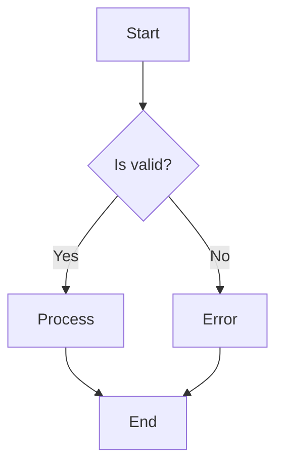
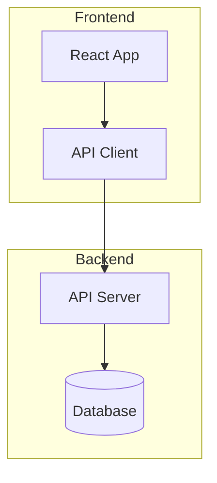
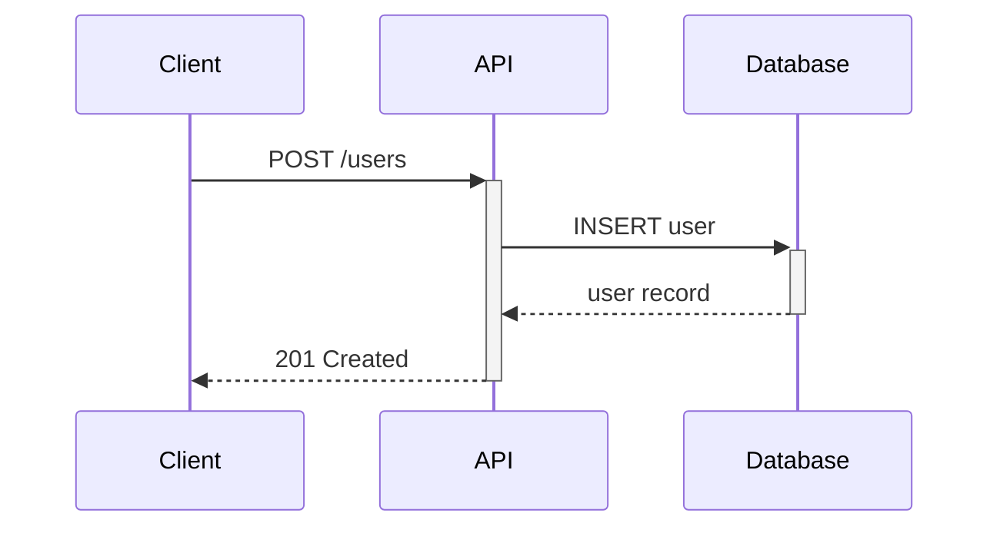
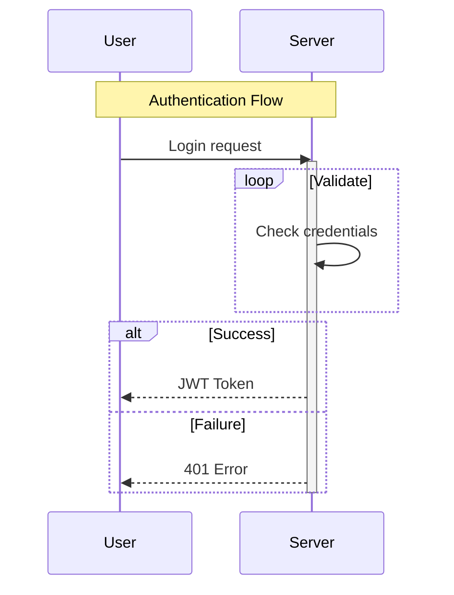
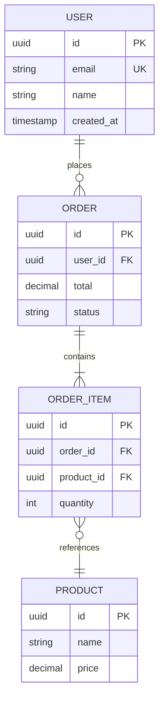
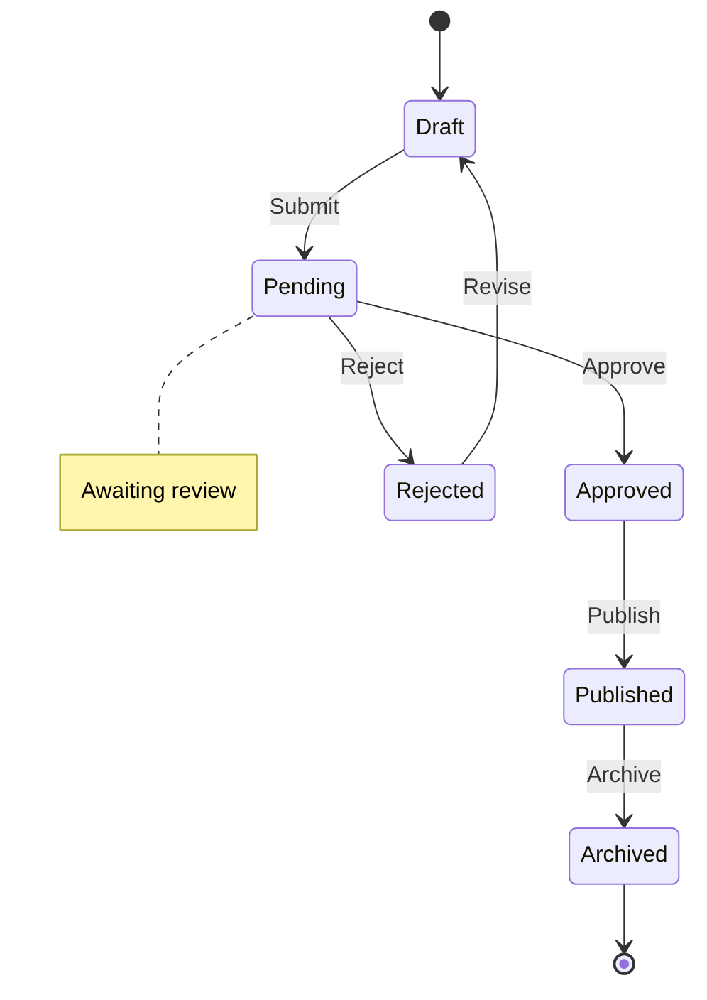
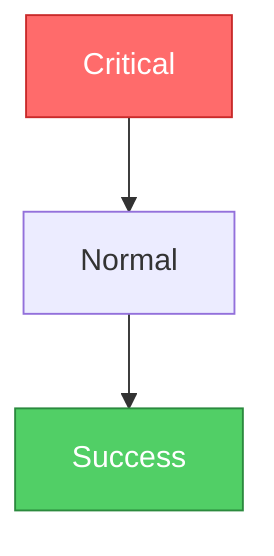
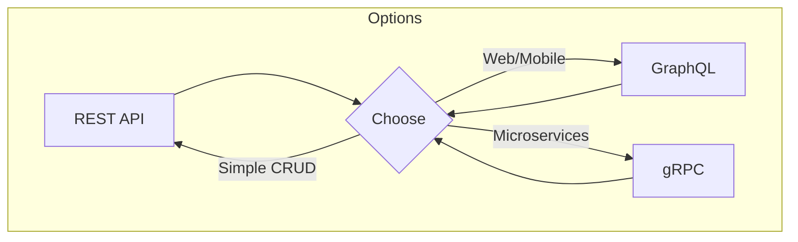
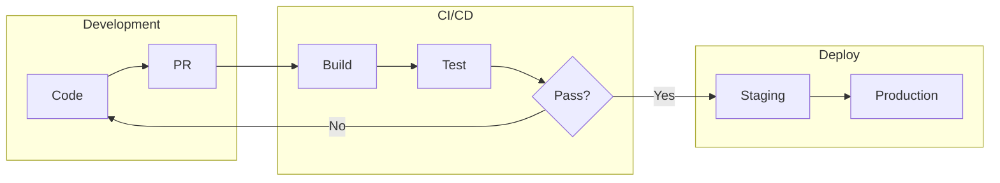
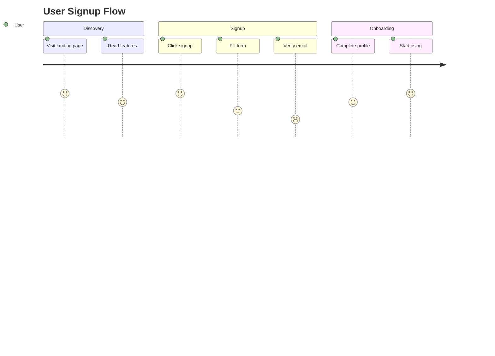

# Mermaid Diagrams - Visual Documentation

> **Philosophy:** A good diagram is worth a thousand words. Keep it simple, readable, and purposeful.

---

## 🎯 Core Principles

| Principle       | Rule                                         |
| --------------- | -------------------------------------------- |
| **Clarity**     | One diagram, one concept                     |
| **Simplicity**  | Avoid overcrowding - less is more            |
| **Consistency** | Same styling and conventions across diagrams |
| **Purpose**     | Every element should serve understanding     |
| **Maintenance** | Easy to update as system evolves             |

---

## 📊 Diagram Types

| Type              | Best For                                |
| ----------------- | --------------------------------------- |
| `flowchart`       | Processes, decision trees, workflows    |
| `sequenceDiagram` | API calls, interactions, timing         |
| `classDiagram`    | Object relationships, inheritance       |
| `erDiagram`       | Database schemas, entity relationships  |
| `stateDiagram-v2` | State machines, lifecycle               |
| `gantt`           | Project timelines, milestones           |
| `pie`             | Proportions, distributions              |
| `gitGraph`        | Branch strategies, merges               |
| `journey`         | User experience flows                   |
| `C4Context`       | System architecture (with C4 extension) |

---

## 📈 Flowchart Patterns

### Basic Flowchart

### Node Shapes

| Shape         | Syntax     | Use For             |
| ------------- | ---------- | ------------------- |
| Rectangle     | `[text]`   | Process, action     |
| Rounded       | `(text)`   | Start/end, terminal |
| Stadium       | `([text])` | Start/end (alt)     |
| Diamond       | `{text}`   | Decision            |
| Hexagon       | `{{text}}` | Preparation         |
| Parallelogram | `[/text/]` | Input/output        |
| Circle        | `((text))` | Connector           |
| Database      | `[(text)]` | Database            |

### Subgraphs for Organization

---

## 🔄 Sequence Diagram Patterns

### Basic API Flow

### Arrow Types

| Arrow   | Meaning                |
| ------- | ---------------------- |
| `->>`   | Solid with arrowhead   |
| `-->`   | Dotted with arrowhead  |
| `->>+`  | Activate lifeline      |
| `-->>-` | Deactivate lifeline    |
| `-x`    | Solid with X (failure) |
| `--x`   | Dotted with X          |

### Notes and Loops

---

## 🗃️ ER Diagram Patterns

### Database Schema

### Relationship Symbols

| Symbol | Meaning      |
| ------ | ------------ | ----------- | ----------- |
| `      |              | `           | Exactly one |
| `o{`   | Zero or more |
| `      | {`           | One or more |
| `o     | `            | Zero or one |

---

## 🔀 State Diagram Patterns

### Lifecycle States

---

## 🎨 Styling

### Theme Options

| Theme     | Best For                |
| --------- | ----------------------- |
| `default` | Light backgrounds       |
| `dark`    | Dark mode documentation |
| `forest`  | Calm, professional      |
| `neutral` | Minimal, clean          |

### Custom Styling

---

## 📋 Best Practices

### Do's

| Practice                | Why                              |
| ----------------------- | -------------------------------- |
| One concept per diagram | Clarity and focus                |
| Use descriptive labels  | Self-documenting                 |
| Consistent direction    | TD/LR - pick one and stick to it |
| Group with subgraphs    | Visual organization              |
| Use proper shapes       | Semantic meaning                 |

### Don'ts

| Anti-Pattern          | Problem                          |
| --------------------- | -------------------------------- |
| Too many nodes        | Overwhelming, hard to read       |
| Long text in nodes    | Cluttered diagram                |
| Crossing lines        | Confusing flow                   |
| Inconsistent styling  | Unprofessional look              |
| No legend when needed | Readers can't understand symbols |

---

## 🔧 Common Use Cases

### Architecture Decision

### Deployment Flow

### User Journey

---

## ✅ Diagram Checklist

Before sharing a diagram:

- [ ] Single clear purpose
- [ ] All nodes have meaningful labels
- [ ] No unnecessary complexity
- [ ] Consistent styling
- [ ] Renders correctly in target platform
- [ ] Accessible (add description if needed)
- [ ] Source stored in version control

---

## 🔗 Related Skills

| Need                   | Skill                     |
| ---------------------- | ------------------------- |
| Architecture decisions | `architecture`            |
| Database design        | `database-design`         |
| API documentation      | `documentation-templates` |
| Project planning       | `plan-writing`            |

---

> **Remember:** The purpose of a diagram is to communicate. If it takes longer to understand the diagram than the concept it represents, simplify it.
